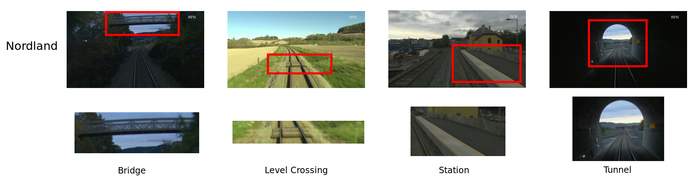
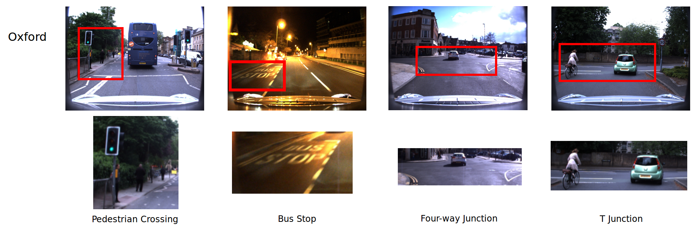

# Nordland and Oxford VPR Dataset

This page presents the subsets of the original Nordland and Oxford Robotcar visual place recognition and scene classification datasets presented in the paper 'OpenSceneVLAD: Appearance Invariant, Open Set Scene Classification' published in ICRA 2022. Please cite our paper if you use this dataset. 

## Getting Started

The first dataset subset presented here is of the Nordland dataset, a 763km train journey through rural Norway. The traversals we use are: spring, winter and summer.  The second subset is of the 9km urban Oxford RobotCar dataset. The three traversals we use are: 2015-07-03-15-23-28 (overcast), 2014-12-16-18-44-24 (night) and 2015-03-24-13-47-33 (sunny). 

These dataset subsets are designed for visually invariant place recognition but we have also hand annoted the datasets to identify four classes within them and all remaining images are labelled as open set images:

Please note: all hand annotations of classes were done were done as reasonably as possible given the challenging and dynamic conditions of the environment.

### Nordland

Class number       | Class label | Average frame count
------------- | -------------  | -------------
1  | Bridge | 81 
2  | Level Crossing | 87
3  | Station | 292
4  | Tunnel | 186
5  | Open Set | 3970
||| Total: 4626

### Oxford

Class number       | Class label | Average frame count
------------- | -------------  | -------------
1  | Pedestrain Crossing | 170 
2  | Bus Stop | 129
3  | Four-way Junction | 152
4  | T-junction | 103
5  | Open Set | 2739
||| Total: 3293

### Format

Each dataset is made up of three folders, one for each traversal. Inside each folder is three things:

* An **images** folder containing all the images from the dataset.
* A **gps.xlsx** file containing the GPS positions of each image. 
* A **scenes.xlsx** file containing the scene label of each image.

### Download

We are currently working on finding as file sharing solution for hosting this large dataset (10GB+), in the meantime anyone who would like a copy of it should raise an issue and I will be in touch.

## Authors

  * **William H.B. Smith** - *Initial work* - [WHBSmith](https://github.com/WHBSmith)

## License

This project is licensed under the MIT License - see the [LICENSE.md](LICENSE.md) file for details

